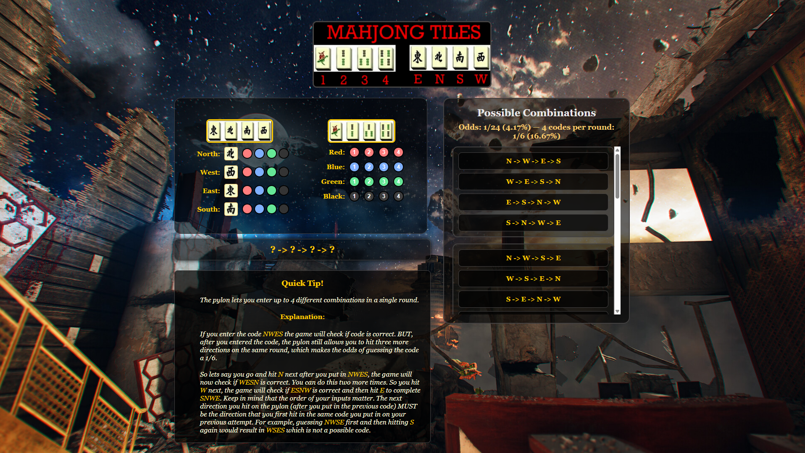
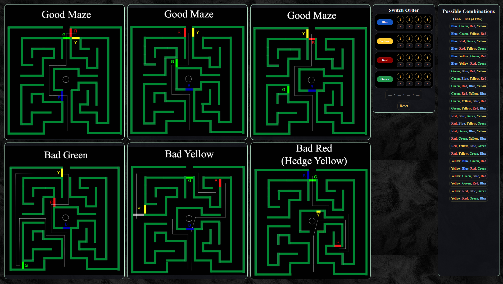

# BO2 EE Resources & Solvers

A collection of interactive solvers, counters & resources for Call of Duty: Black Ops II - Zombies Easter Eggs

## Website link

https://krule6.github.io/BO2-EE-Resources/

# Website Resources

## Tranzit - Map & Portal Destinations ( WORK IN PROGRESS )

## Die Rise - Mahjong Tile Solver

- A simple and interactive Mahjong Tile Solver

- Interactive tracker to record the mahjong tiles corresponding direction/number and see possible combinations

## Buried - Switch Tracker, Maze Layouts

- Good/Bad maze layouts

- Interactive tracker used to solve the correct order of the switches and see possible combinations

- Ciphers image

## Buried - RNG Counters

- Bofa, Vulture Aid & Game Since Bofa counter: <a href="https://github.com/Krule6/BO2-EE-Resources/releases/download/bo2-ee-resources/buried_ee_counters.gsc">Download Here</a> and place the script in
  <pre>
  C:\Users\%username%\AppData\Local\Plutonium\storage\t6\scripts\zm
  </pre>
- Chat commands to keep track of data during a session (Mainly used for Easter Egg Speedruns)

### Chat commands

| Command | Description                                       |
| --------| ------------------------------------------------- |
| bofa    | Toggle Bofa counter (Paralyzer & Timebomb). Counts everytime you get both items from the mysterybox |
| vulture | Toggle Vulture Aid counter. Counts everytime you get vulture aid from the witches |
| gsb     | Toggle Game Since Bofa counter. Counts how many resets without getting Bofa from the mysterybox | 

