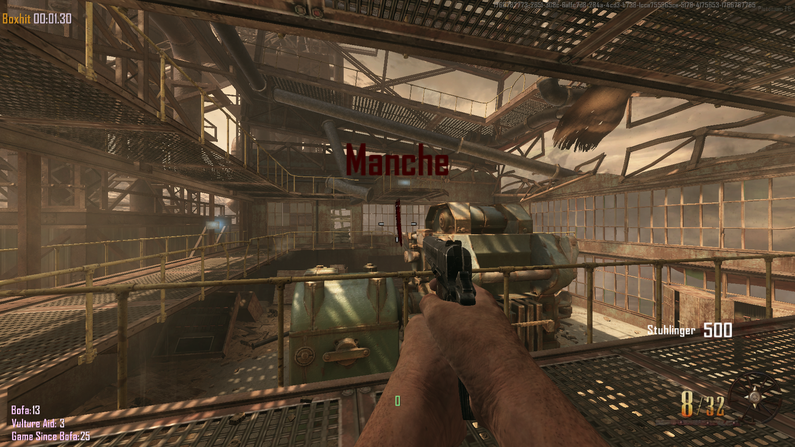
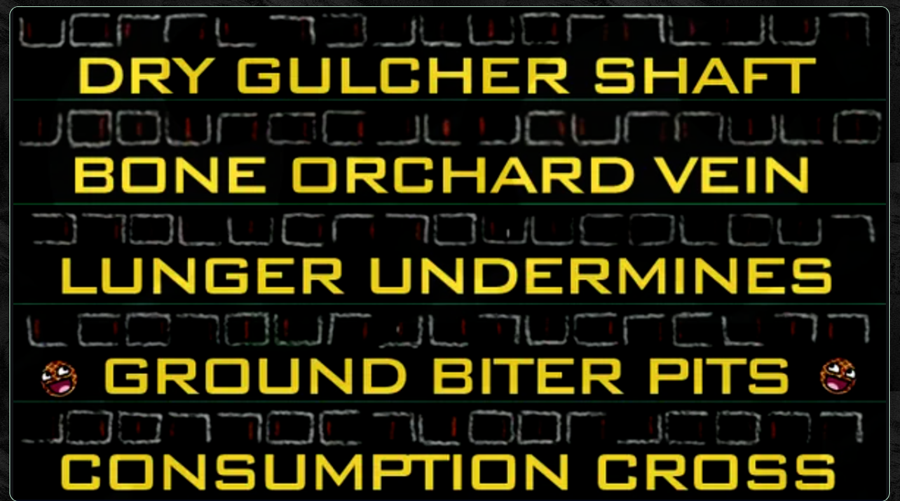

# BO2 EE Resources & Solvers

A collection of interactive solvers, counters & resources for Call of Duty: Black Ops II - Zombies Easter Eggs

## Website link

https://krule6.github.io/BO2-EE-Resources/

# Resources & Solvers

### Tranzit - Map & Portal Destinations

- A visual map of tranzit with all locations for the mystery box, teleports, site locations, perk machines etc
  
- Features a hover function that shows the in game teleport locations to help players navigate through the map

### Die Rise - Mahjong Tile Solver

- A simple and interactive Mahjong Tile Solver

- Interactive tracker to record the mahjong tiles corresponding direction/number and see possible combinations

### Buried - Switch Tracker, Maze Layouts & Counters

- Good/Bad maze layouts

- Interactive tracker to record correct switch order and see possible combinations

- Bofa, Vulture Aid & Game Since Bofa counter: <a href="https://github.com/Krule6/BO2-EE-Resources/blob/main/buried_ee_counters.gsc">Download Here</a> and place the script in
  <pre>
  C:\Users\%username%\AppData\Local\Plutonium\storage\t6\scripts\zm
  </pre>

- Quick reference ciphers image

